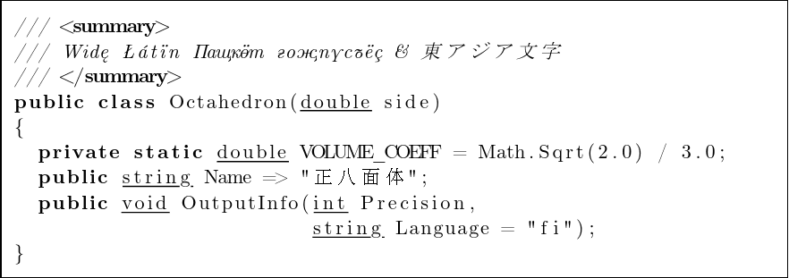

# lstcol.js

A small script that mimics the fixed-column alignment of the listings package
for LaTeX. A code listing is typeset in a proportional font, but aligned to some
grid making it look as intended by the programmer.



Can be used with some CSS Typesetting tools working in the browser.

## Usage

⚠️ Your browser needs to support the [`Intl.Segmenter`][intl] API for the script
to work. Check the linked page for the compatibility information.

Download [the script](./dist/index.js) and place it on your web server or
reference it by the direct link, then import it as follows (`<script
type="module">` will be needed):

```javascript
import { alignListings } from "./dist/index.js";
```

The `alignListings` function should be called with a settings object of the
following form:

```javascript
{
  /**
   * Target element(s) to apply column alignment to. May be a string, an
   * immediate element, or an array of elements. When a string is given, it
   * should be a CSS selector.
   */
  target: "pre > code",
  /**
   * Width of a single character cell (column) as a fraction of the font size
   * (optional).
   * The default is `0.6`.
   */
  baseWidth: 0.6,
}
```

The `target` setting is mandatory.

It is recommended that code highlighting and other similar procedures are run
before this function.  `alignListings` works by inserting some spacing elements
between the text nodes that might end up stripped out by other tooling.

Also, if your page uses some custom web fonts, make sure that they are fully
loaded when the function is executed, otherwise the alignment would be broken.

[intl]: https://developer.mozilla.org/en-US/docs/Web/JavaScript/Reference/Global_Objects/Intl/Segmenter
